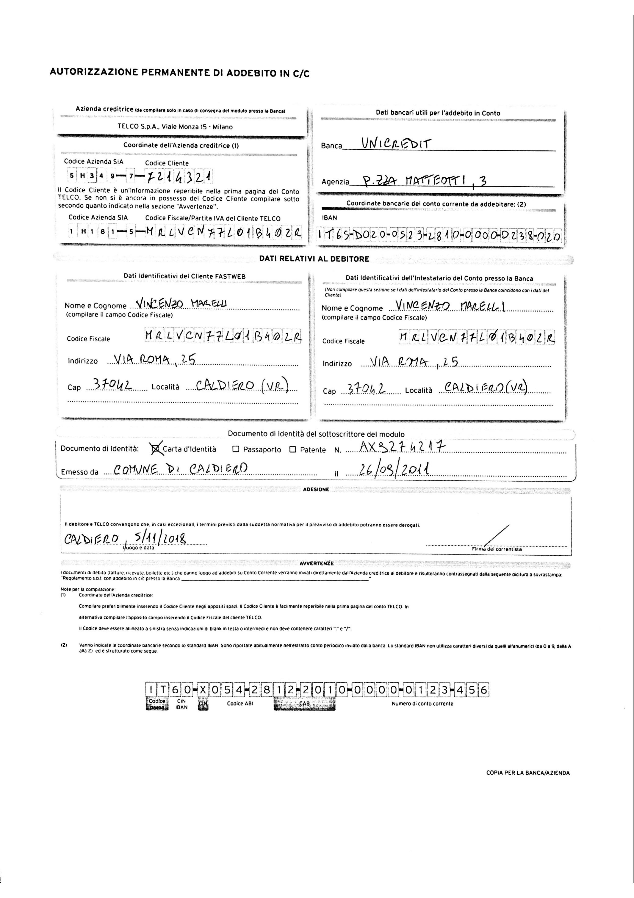

# Handwriting-analysis-from-forms

Input data can be classified into two categories:

1. Forms

2. Continuous Handwriting

In case your input is a form image, store it inside the Input folder as form.jpg. The output will be available inside Output/forms/ folder.

In case your input is a continuous handeriting image, store it inside the Input folder as continuous.png. The output will be available inside Output/continuous_handwriting/ folder.

In order to perform handwriting recognition, go inside src folder. Execute 'python run.py --form' if input is form, otherwise execute 'python run.py --continuous'.

The dataset consisted of IAM and NIST databases. 
Download IAM dataset from 'http://www.fki.inf.unibe.ch/DBs/iamDB/data/words/words.tgz' and NIST dataset from 'https://s3.amazonaws.com/nist-srd/SD19/by_field.zip'. Unzip the words folder and the by_field folder espectively and store them inside the data folder.

To train the model, go inside src folder and execute 'python main.py'.

Currently, the accuracy of the model is 86.043711%.

We have used and edited the following reository https://github.com/githubharald/SimpleHTR.
